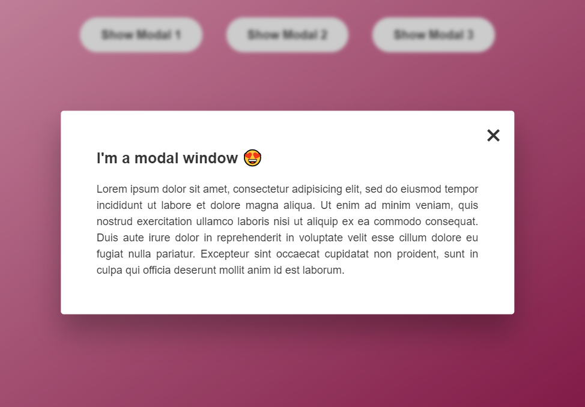

<h2>Modal Window</h2>

  This is a Modal Window developed with HTML, CSS and JavaScript during "The Complete JavaScript Course" by Jonas Schmedtmann.

  The window has three buttons which open modals with a transparent overlay and a cool white text page! 😎

  If you want to close the modal, there's no problem at all. You can either click the close button, click outside the modal or press your Esc key! Great, right?

I could learn a lot about class manipulation with this project!

<h2>Final Result:</h2>

Initial Page

Modal Opened!

Made with 💖 by Marília Pacífico.

